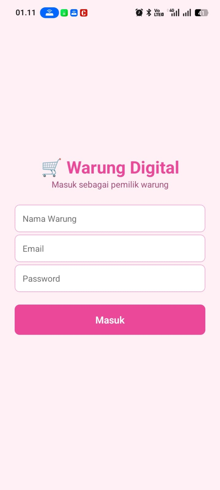
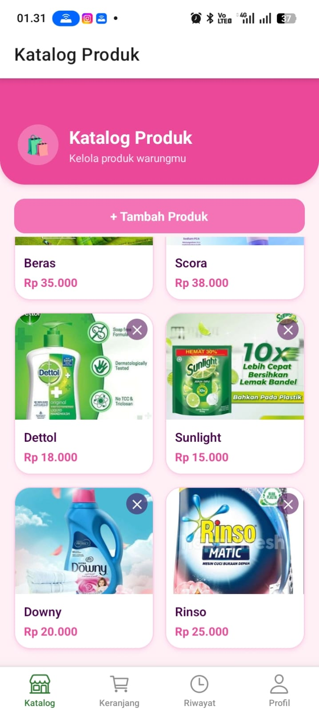
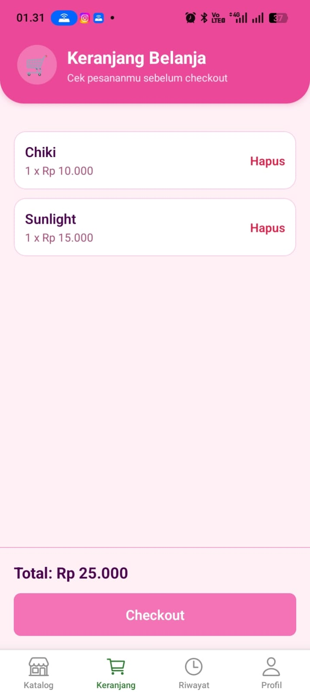

# Warung Digital — Domain: Warung Digital


> Aplikasi kasir & katalog produk sederhana untuk pemilik warung/UMKM. Pemilik warung bisa login,
> menambahkan produk lengkap dengan foto, mengelola keranjang belanja, dan melihat riwayat transaksi —
> semua tersimpan secara lokal di HP.

---

## 📸 Screenshots

| Login Screen | Katalog Screen | Keranjang Screen |
|:---:|:---:|:---:|
|  |  |  |

---

## ✨ Fitur Utama

- [x] Login pemilik warung dengan validasi form
- [x] Katalog produk dengan FlatList (tambah & hapus produk)
- [x] Detail produk dengan navigasi Stack + params
- [x] Keranjang belanja dengan perhitungan total otomatis
- [x] Foto produk via expo-image-picker (kamera + permission handling)
- [x] Riwayat transaksi tersimpan permanen dengan AsyncStorage
- [x] Bottom Tab Navigation (Katalog, Keranjang, Riwayat, Profil)

---

## 🛠️ Tech Stack

| Layer | Teknologi |
|-------|-----------|
| Framework | React Native + Expo |
| Navigation | React Navigation v7 (Stack + Bottom Tab) |
| Storage | @react-native-async-storage/async-storage |
| Device | expo-image-picker |
| Build | EAS Build (Expo Application Services) |

---

## 🚀 Cara Menjalankan

```bash
git clone https://github.com/username/nama-repo.git
cd nama-repo
npm install
npx expo start
```
Scan QR Code dengan Expo Go di HP.

---

## 📦 Download APK

[Download APK terbaru](LINK_APK_GITHUB_RELEASE_ATAU_DRIVE)

---

## 🌐 Expo Snack

[Buka di Expo Snack](LINK_EXPO_SNACK)

---

## 👤 Developer

**Nama Lengkap** | NIM | Kelas
Universitas Prima Indonesia — Prodi Sistem Informasi
Mata Kuliah: Pemrograman Mobile (TI-MOBILE-01)
